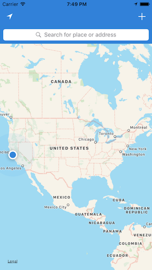
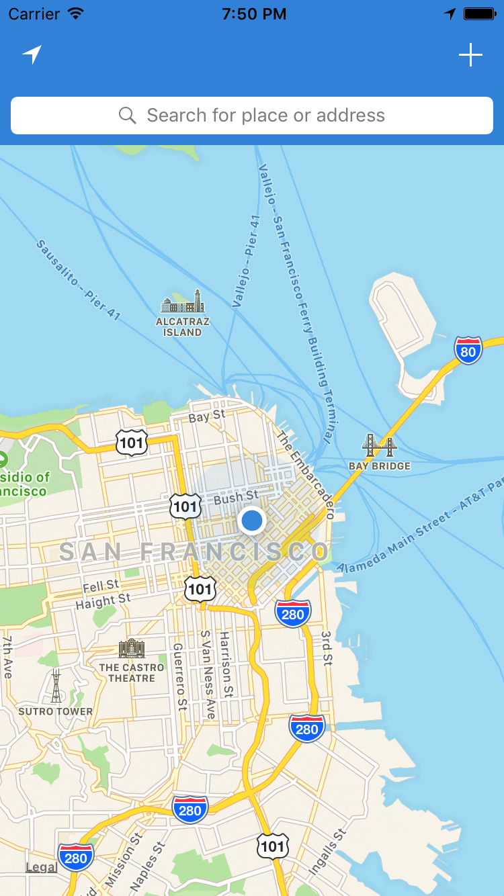
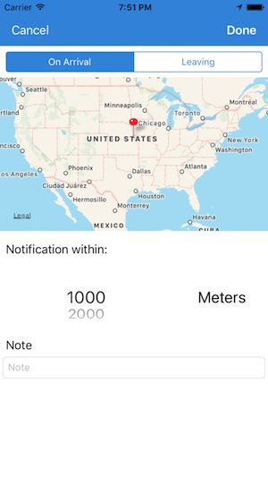

# LocationNote

LocationNote is a location based app that sends notifications as reminders by using geofencing.

# To implement

* ~~ Keep track of device's location~~

* __Creating notes__

* Annotationg UI

* Data persistency
 
# What the app will look like roughly

